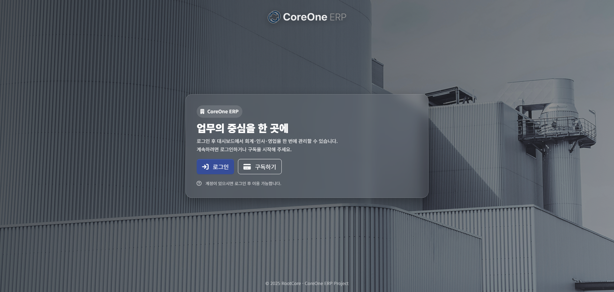

# 🖥️ 구독형 ERP README

 

## 📝 프로젝트 개요
> 회계·영업·인사 업무를 통합 관리할 수 있는 구독형 ERP 시스템을 구현한 프로젝트 
- 사용자는 구독 여부에 따라 시스템 이용이 가능하며, 로그인한 사용자 권한에 따라 접근 가능한 메뉴와 기능이 다르게 제공되도록 설계함
- 회계·영업·인사 모듈을 중심으로 기업의 주요 업무 흐름을 하나의 시스템에서 관리할 수 있도록 구성하였으며, 실제 서비스 형태의 ERP 구조를 구현하는 데 주안점을 두었음

 

## 👨‍👩‍👧‍👦 팀원
|                              고유한                              |                              이한솔                              |                              우상준                              |                              장준현                              |                              박봉근                              |                              방재우                              |
|:-------------------------------------------------------------:|:-------------------------------------------------------------:|:-------------------------------------------------------------:|:-------------------------------------------------------------:|:-------------------------------------------------------------:|:-------------------------------------------------------------:|
|  |  |  |  |  |  |
|                            팀장, 배포                             |                           부팀장, 공통모듈                           |                              산출물                              |                           DataBase                            |                            GitHub                             |                             개발환경                              |
|                              회계                               |                              인사                               |                          로그인, 시스템관리                           |                              인사                               |                              영업                               |                              결제                               |
|            [GitHub](https://github.com/rhdbgks123)            |           [GitHub](https://github.com/hansollee92)            |           [GitHub](https://github.com/sangjun1027)            |           [GitHub](https://github.com/junhyeon0325)           |               [GitHub](https://github.com/obng)               |           [GitHub](https://github.com/jaewoo-bang)            |

 

## ⚙️ 구현 기술

    
    
    
    
    
    
    
    

## 📅 개발기간
> 전체일정 : 25.11.14 ~ 25.12.26

|  구분  |      기간       |              활동               |                 비고                  |
|:----:|:-------------:|:-----------------------------:|:-----------------------------------:|
| 사전기획 | `11.14 ~ 11.17` |       프로젝트 기획, 요구사항 분석        |               요구사항정의서               |
| 화면설계 | `11.18 ~ 11.19` |      화면 UIUX 설계, 업무 흐름도       |                화면설계서                |
| DB설계 | `11.20 ~ 11.21` | 테이블정의서, ERD 작성,  공통코드 설계서 |        ERD, 테이블정의서, 공통코드 설계서        |
|  개발  | `11.24 ~ 12.12` |          화면구현, 기능구현           | 프로그램 목록, 간트차트, 개발일지,  단위테스트 명세서 |
| 테스트  | `12.17 ~ 12.22` | 초기배포, 통합테스트,  결함 기록 및 수정  |          통합테스트 시나리오, 결함대장           |
|  배포  | `12.23` |       최종 빌드 배포, 운영환경 적용       |                완료보고서                |

## 💭 느낀점
- ERP라는 도메인에 대해 좀 더 깊게 공부해 볼 수 있는 시간이 되었음
- 여러 기능을 사용해 보고 설계대로 구현해 내는 것이 좋았지만 전체적인 시스템의 볼륨을 키우지 못한 것이 아쉬움

## 🔢 완성도 평가
💯 완성도 점수 : 90점

💬 총평 : 초기에 실무 활용 가능하도록 기획 및 설계하였고 거기에 맞게 개발이 완료되었으나 UI적인 부분과 사용자 친화적인 부분에서 부족한 점이 있음
